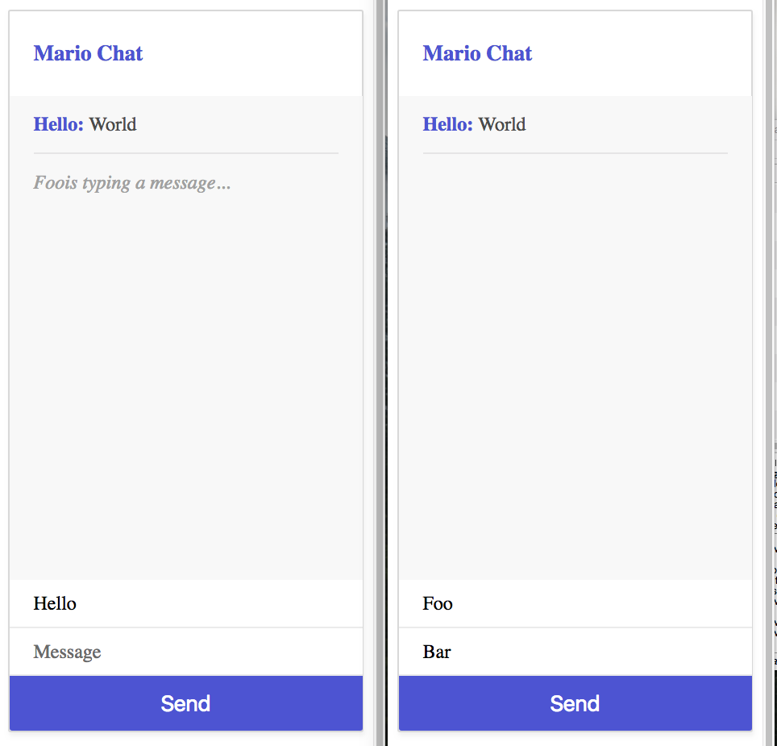

# How To Run



## On a local NodeJS server:

 1. Move all files to NodeJS's working directory
 2. Initialize the project and install its dependencies:

```bash
npm install
```

 3. Start the server:
 
 ```bash
 node index
 ```
 
  4. Go to http://localhost:4000
  
  ## In a Docker container:
  
  1. Create a Docker container from the node image _(adding your own local path)_:
  
  ```bash
  docker run -it --rm --name websockets \
    -p 4000:4000 \
    -v /path/to/local/files:/usr/src/app \
    -w /usr/src/app \
    node
```

 2. Start an interactive bash shell in the container:
 
```bash
docker exec -it websockets bash
```

 3. Initialize the project and install its dependencies:

```bash
npm install
```

 4. Start the server:
 
 ```bash
 node index
 ```
 
 5. Go to http://localhost:4000
